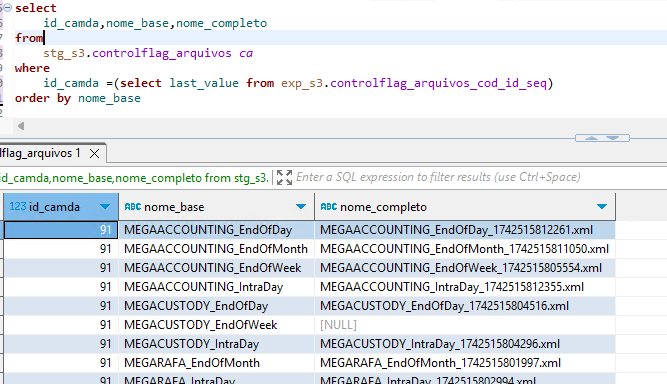

1. [Objetivo](#objetivo)
2. [Relacion de módulos, archivos y extracciones](#relacion-de-módulos-archivos-y-extracciones)
3. [Tablas de Control](#tablas-de-control)
   1. [Explicación id\_camda](#explicación-id_camda)
   2. [controlflag\_arquivos](#controlflag_arquivos)
   3. [controlflag\_interfaces](#controlflag_interfaces)
4. [Consideraciones](#consideraciones)
5. [Acciones Pendientes](#acciones-pendientes)

# Objetivo

Este CR surge de la necesidad de tener más trazabilidad en la carga de archivos que recibimos de MEGARA y se basa en la mejora de dos puntos principalmente:
1. Manejo de extracciones procesadas.\
    Actualmente recibimos **134 Extracciones** en la dirección `/prdmegara/PRD/Devices/MegaCommon/innotech/` y nuestros  **conversores JAVA** se encargan de buscar durante max 2 min la presencia de su archivo asignado.\
    Este CR contempla  recibir **9 Archivos Flag** de **3 Módulos diferentes**, dichos archivos contienen la relación de las extracciones que recibimos en `/prdmegara/PRD/Devices/MegaCommon/innotech/`.\
    Como ya sabemos exactamente el nombre de las extracciones que recibimos: no tenemos que hacer una busqueda intensa por cada uno de los 134 archivos.
2. Control de datos mapeados.\
   La opción por la que se ha decantado S3 es que cuando falte alguna extracción en una carga de archivos, no se actualicen los campos `cod_flag_mapeo` de las **tablas principales sss**. Este campo indica a las funciones de mapeo con que registros trabajar. En consecuencia, si hay alguna extracción faltante en una ejecución, la siguiente ejecucion trabajará con un bloque mayor de información; se hará de este modo hasta que recibamos un paquete completo de interfaces.
   

 
# Relacion de módulos, archivos y extracciones
Los archivos flag recibidos cada 10 minutos serán de la forma:
1. MEGACOMMON_EndOfWeek_xxx.xml
1. MEGACOMMON_IntraDay_xxx.xml
1. MEGACOMMON_EndOfDay_xxx.xml
1. MEGACOMMON_EndOfMonth_xxx.xml
1. MEGACUSTODY_IntraDay_xxx.xml
1. MEGACUSTODY_EndOfDay_xxx.xml
2. MEGACUSTODY_EndOfWeek_xxx.xml **(este se recibe una vez cada hora)**
3. MEGARAFA_IntraDay_xxx.xml
4. MEGARAFA_EndOfMonth_xxx.xml

A continuación la relación de módulos, archivos y extracciones.

	
   1. MegaAccounting. *Módulo*
      1. MEGAACCOUNTING_EndOfWeek *Archivo*
         1. ClientTransaction
         2.  CashTransferOrder
         3. CreateCAFromLoanScheduleSLA
         4. Unit
         5. Fund
         6. TaxPayerCategory
         7. TypeOfApplicationShort
         8. TypeOfApplicationLong
         9.  CAConfiguration
         10. OptionConfiguration
         11. Rentability
         12. SwapAssetTypeOption
         13. CVMLongClassification
         14. Equity
         15. AccountNature
         16. AccountCategory
         17. NationalClassification
      2.  MEGAACCOUNTING_IntraDay *Archivo*
           1.  CGCPosition
           2.  BenchmarkPerformance
           3.  performance
           4.  RentabilityFA
           5.  NetAssetValue
           6.  CashMovement
           7.  ClientBalance
           8.  YieldCurve
           9.  CashAccountingEntry
           10. Commodity
           11. Consultant
           12. Counterparties
           13. CountryCalendar
           14. Custodian
           15. CustodyBalanceRegister
           16. DetailedPriceCriterion
           17. EconomicAgentCategory
           18. EntitySector
           19. ExternalCashAccount
           20. Guarantor
           21. ReferenceRatePrice
           22. SecurityAccountingEntry
      3.  MEGAACCOUNTING_EndOfDay *Archivo*
          1.  DetailedCashFlow
          2.  AssetController
          3.  AssetManager
          4.  AutonomousAgent
          5.  Bank
          6.  Broker
          7.  FiduciaryAgent
          8.  FiscalProfile
          9.  Forward
          10. FRC
          11. FundAdministrator
          12. FundAuditor
          13. FundClassification
          14. FundDistributor
          15. IndexBenchmark
          16. Issuers
          17. LiabilitiesController
          18. MainEntityCalendar
          19. PricingRule
          20. PricingRuleProfile
          21. ReferenceRate
          22. Regulator
          23. RiskAgent
          24. SCC
          25. SCS
          26. Fund Manager
          27. CSD
          28. ScriptByClient
          29. SecuritiesLendingRegister
          30. ValuationPriceSLA
      4.  MEGAACCOUNTING_EndOfMonth *Archivo*
          1.  Bonds
          2.  NAVRentabilityDetails
          3.  EligiblePosition
          4.  SecurityPrice
          5.  ValorizedPosition
          6.  ClientSecurityPayment
          7.  ClientInstruction Cor
          8.  ClientCashAccount
          9.  STI
          10. Future
          11. Right
          12. CVMShortClassification
          13. ClientCashAccbySecAcc
          14. ClassificationFATCA
          15. FiscalClassification
          16. Market
          17. ClientSecAccount
          18. ContractualClient
          19. Country
          20. Currency
          21. NostroSecAccount
          22. TransactionType
          23. NostroSecAccountSLA
          24. CA
          25. ClientEntitlement
          26. ClientCashPayment
          27. ClientInstruction
          28. FiscalNature
          29. PayableReceivable
          30. SupervisionDashboard
          31. NavDetails
          32. ProblemCode
      5.  MEGGAACCOUNTING_EndOfWeek
          1.  Option
   2.  MegaCustody *Módulo*
       1.  MEGACUSTODY_IntraDay *Archivo*
           1.  RegularTransaction
           2.  CashTransactionType
           3.  PledgeRequest
           4.  NetMarketExecution
           5.  NetMarketExecConfirmationExtractConfig
           6.  IncomingNetMarketExecutionExtractConfig
           7.  ForeignExchangeRate
           8.  DepledgeRequest
       2.  MEGACUSTODY_EndOfDay *Archivo*
           1.  CodificationConfig
           2.  FixAmountFeeRule
           3.  FixRateFeeRule
           4.  ScaledFeeRule
           5.  PledgingReason
           6.  ShortSellingSLA
           7.  PaymentChannel
           8.  Mututal Fund Calendar
           9.  MarketTradeCommSLA
           10. CSDCalendar
           11. BrokerCommissionSLA
   3.  MegaraFA *Módulo*
       1.  MEGARAFA_IntraDay  *Archivo*
           1.  SurperformanceNavDetailExtractConfig
           2.  ShareOutStandingByUnit
           3.  LiabilitiesOperation
           4.  FeesDetails
           5.  Derivativeadjustment
           6.  DepoValorizedPosition
       2.  MEGARAFA_EndOfMonth *Archivo*
           1.  DeferredFeesPaidSLA
           2.  RelatedBillProcessSLA
           3.  PeriodiCMngtFeesConfig
           4.  ManagementFeesSLA
           5.  IndexRentabilityDetails
           6.  FeesType
           7.  BillingDatesSLA

       

# Tablas de Control
Existen dos tablas de control:
- stg_s3.controlflag_interfaces
- stg_s3.controlflag_arquivos

## Explicación id_camda
Este campo esta presente en las dos tablas de control.\
Es un identificador secuencial por lote de ejecución, por ejemplo: para la ejecución de las 13:00 hrs la tabla *stg_s3.controlflag_arquivos* tendrá el mismo *id_camda* en 9 registros, uno por cada archivo flag.

[id_camdaarquivos]: images/id_camdaarquivos.png "id_camdaarquivos" 
![id_camdaarquivos][id_camdaarquivos] 

Análogamente, la tabla de *stg_s3controlflag_interfaces* tendrá el mismo comportamiento, teniendo 133 registros con el mismo id_camda (o 134, recordando que una interfaz la recibimos una vez cada hora)

## controlflag_arquivos

Esta tabla contiene la relación de los archivos flag recibidos.

Explicacion de los campos de la tabla:

- **id_camda** 
  - [Previamente explicado](#id_camdaarquivos).
- **id**
  - id secuencial unico para cada registro
- **nome_base**
  - A que archivo flag pertenece el archivo tratado, mostrado [previamente](#id_camdaarquivos).
- **nome_completo**
  - Nombre del archivo flag recibido y trabajado en esa ejecucion
   

- **data**
  - Este valor representa en que momento se empezó el job de rundeck. 
      

- **data_recebemento**
  - Indica la hora en la que fue recibido el respectivo archivo flag en la carpeta de `/prdmegara/PRD/Devices/MegaCommon/innotech/`
   
   Recordando que el tiempo maximo de recibiento son 2 min a partir de que inicia el job de rundeck.

[Este documento](./MEGAACCOUNTING_EndOfDay_1739905158481.xml) es el ejemplo del contenido de un archivo flag, asi lo leemos y de informa la tabla `stg_s3.controlflag_interfaces` de la siguiente manera

## controlflag_interfaces

Esta tabla contiene la relación de las interfaces recibidas por archivo flag.

Explicacion de los campos de la tabla:
- id_camda
  - [Previamente explicado](#id_camdaarquivos).
- id
  - id secuencial unico para cada registro
- id_arquivo_flag
  - Este campo se puede eliminar, su proposito era ligarlo con el campo `id` de `stg_s3.controlflag_arquivos`
- nome_flag_geral
  - De cual de los 9 archivos flag proviene la interfaz.
- nome_flag_completo
  - Indica el archivo flag especifico del cual proviene el xml procesado
- nome_interface_base
  - A que interfaz pertenece el xml procesado
- nome_interface_completo
  - El nombre completo del archivo xml procesado
- recebido
  - Indica si efectivamente el archivo xml estaba en la carpeta `/prdmegara/PRD/Devices/MegaCommon/innotech/` 
  **OJO** Este parametro es importante, porque si bien el archivo flag nos dice lo que en teoria recibimos, este campo sirve de verificacion.
  Si tenemos un null aqui, significa que aunque el archivo flag diga que lo recibimos, realmente no lo fue.
- track_status
  - Campo informado por el xml que indica si fue generado exitosamente o no
- data_recebemento
  - Indica la hora en que recibimos el xml en la carpeta `/prdmegara/PRD/Devices/MegaCommon/innotech/` 
- data_fim_conversao
  - Este sería el momento en que termina de convertirse el java, pendiente desarrollo para informar.
  

# Consideraciones
- Se considera un GAP de dos minutos para recbir 8 archivos flag cada 10 min (9 cada hora), de no ser asi:
  Si no se reciben todos los archivos flag:  
  - No se ejecutarán los mapeos.
  - No se actualizará ningún valor `cod_flag_mapeo` de ninguna tabla `SSS_`.

- Si los archivos listados en los archivos flag no coinciden con los archivos recibidos en `/prdmegara/PRD/Devices/MegaCommon/innotech/`:
  - No se cargará informacion de el/los archivos discrepantes.
  - No se ejecutarán los mapeos.
  - No se actualizará ningún valor `cod_flag_mapeo` de ninguna tabla `SSS_`.
  - Se mantendrá el archivo discrepante en la carpeta `/prdmegara/PRD/Devices/MegaCommon/innotech/` hasta su eliminación manual. **PENDIENTE AJUSTE**
   
- Carga manual de Archivos
  - La inserción manual de archivos en `/prdmegara/PRD/Devices/MegaCommon/innotech/` deberán ser informados en el contenido de su respectivo archivo flag.
  - Se deberán recibir todos los archivos flag.
  - Se deberán recibir todos los archivos listados en los archivos flag.\
  La ómisión de alguno de estos puntos provoca:
    - Los archivos insertados manualmente no serán consumidos por Rundeck.
    - No se llevarán a cabo mapeos.
    - El campo `cod_flag_mapeo` de todas las tablas `SSS_` se mantendra de la forma `cod_flag_mapeo = null`.
- ¿Cuando informar a s3?
  - Cuando el paso "Validacion cantidad de interfaces recibidas" de error, pues lo que ahce es contar cuantos archivos fueron procesados.
- Todo archivo flag procesado se mueve a la carpeta `/prdmegara/PRD/Devices/MegaCommon/innotech/Flags` al final de su lectura.

# Acciones Pendientes
- Actualmente el hacer o no mapeos se decide en base a la cantidad de interfaces recibidas, se debe de implementar la validacion de que el java ha ido correctamente.
- Arreglar parte de encriptacion de los xml
- Agregar alertas de fallo.
